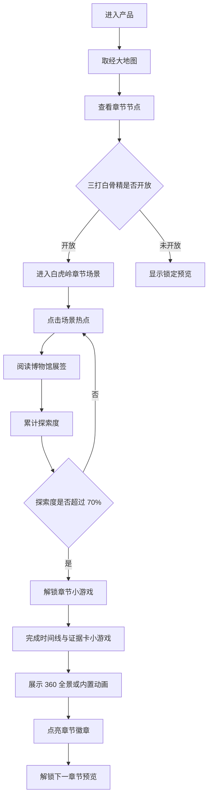

# 用户流程

## 1. 总流程

## 2. 大地图流程

大地图是主导航和进度系统，不只是装饰背景。

大地图显示：

- 取经路线
- 已解锁章节
- 当前章节
- 锁定章节
- 已完成章节徽章
- 下一章节预览

MVP 中只有“三打白骨精”完整可玩，其他节点显示为锁定或预览状态。

## 3. 章节探索流程

章节页以一张高完成度场景图作为主界面。用户点击图中热点进入展签。

热点类型：

- 人物：孙悟空、唐僧、猪八戒、白骨夫人等
- 物件：斋饭、钵盂、行李、兵器等
- 场景：白虎岭、山路、村舍、妖气区域等
- 事件：三次变化、悟空识破、唐僧责怪、逐走悟空等

每个热点对应一张或多张展签。

## 4. 展签流程

展签为博物馆风格卡片。

默认结构：

- 标题
- 类型
- 所属回目
- 繁体原文
- 简体白话解释
- 相关人物/物件/场景
- 探索度权重
- 阅读确认状态

用户打开关键展签并完成阅读确认后，该展签计入探索度。

## 5. 探索度规则

章节探索度不是点击数量，而是关键内容覆盖率。

建议权重：

- 主线原文段落：50%
- 关键人物卡：15%
- 关键物件/地点卡：15%
- 事件顺序/因果理解：10%
- 隐藏细节/彩蛋：10%

达到 70% 后解锁章节小游戏。

## 6. 小游戏流程

小游戏使用简体白话。它是章节完成前的互动体验，不是文言考试。

第一版小游戏：

- 用户看到一条白虎岭事件时间线
- 底部有若干事件卡
- 用户拖拽事件卡到正确顺序
- 关键节点需要匹配原文线索卡
- 完成后给出简短反馈

## 7. 奖励流程

小游戏完成后：

- 播放或展示预生成 360 全景/内置动画
- 点亮“三打白骨精”徽章
- 本地保存章节完成状态
- 大地图中下一节点变为预览状态

